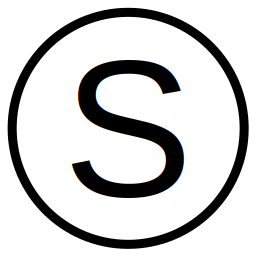
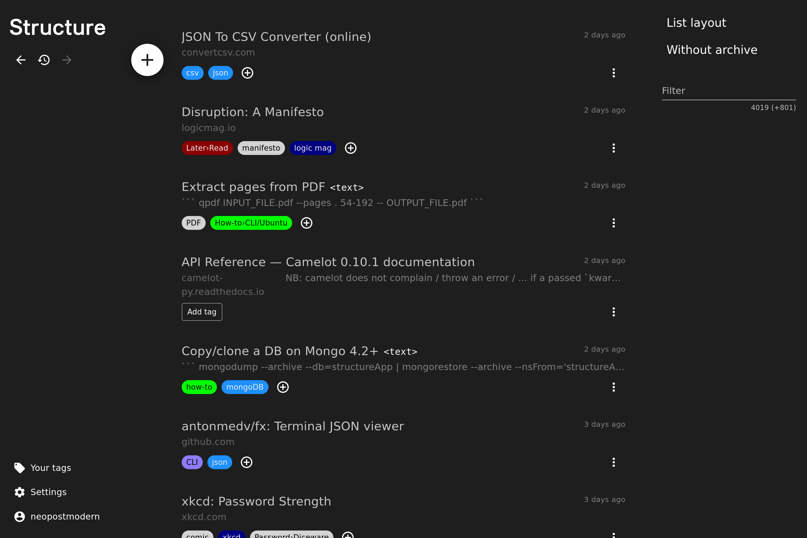

<p align="center">

</p>

# Structure
Structure is a knowledge management tool.   
It provides a fast approach to storing and retrieving thousands of informations. 
Currently, it handles links (URLs) and text-only notes. 
It currently replaces bookmarking, note-taking and knowledge-base apps. 
In the future it will also be able to handle (small) files, snapshoting of stored websites, 
sharing of individual notes or entire (sub)structures, versioning and much more.



The core organization mechanism are tags, there are no folders. 
This allows you to cope with the vast and diverse data points you need to manage in a connected information society.

Above all it acts as a single entry point: 
*Did I bookmark this in Firefox or Chrome?*
*Did I send the link via mail or chat?*
*Is the note in my note-taking app or in a Markdown file in the project folder?*
*Which folder should it go into?*
*Did I star that tweet or screenshot it?*
*Is that CLI argument still findable in my history or can I find the StackOverflow answer again?*  
Structure's answer is: it's always in Structure and you can quickly search for it, 
no matter if you saved a good article five years ago or documented a work process last week.

Common scenarios Structure is well suited for:
- Storing links
    - to read/listen/watch later (like Pocket), independently of platforms (unlike Twitter stars)
    - you need to come back to regularly (e.g. the direct link to some hard to find sub-page of your bank, like bookmarks)
    - to articles you want to remember, possibly with important excerpts (like Zotero)
- Capturing a quick thought or recommendation (like any note taking app)
- Documenting steps of setting up a project (configuration options, commands executed, software/packages installed)
- Being available on all your devices, light-mode and dark-mode, focused on UX
- Associating one note with multiple tags (topics, projects, work areas...)
- You don't want your data to be analyzed/sold/... (also see *Self-hosting*)

Common scenarios Structure is not (yet) well suited for:
- Planned
    - Archiving and full-text search of stored websites (like archive.org)
    - WYSIWYG Markdown editing (like Typora)
    - Publishing of individual notes (like Medium)
    - Publishing of collections
    - Sharing / collaboration
- Considered
    - Adding custom fields to notes (like Notion)
- Not currently planned
    - Generating citations (like Zotero)
    - Being file-system based (like your file-system)

## Installing
The fastest way to get started is the [web version](https://app.structure.love). 
You can install it as a PWA from your mobile browser too, there are no dedicated mobile apps yet.

For desktop, it is recommended to use the dedicated electron app, 
which you can download from the [latest GitHub release page](https://github.com/neopostmodern/structure/releases/latest) under *Assets*.

## Self-hosting
You can (and depending on your requirements, such as privacy concerns, should) host structure yourself. 
There is no documentation yet but the following files should get you started:
```
config/config-example.json
server/scripts/deploy/deploy.sh
.github/workflows/staging.yml
```

It depends on node.js (server version specified in `server/package.json`&rarr;`volta`) and mongoDB 4.2+.

A docker version is planned.

## Development
The project is based on this monorepo. For software requirements and setup see *Self-hosting*.
To run execute (in two terminals, from the root folder)
```
npm run client:web:start # or client:electron:start for the desktop app
```
and
```
npm run server:start
```

Comprehensive PRs are very welcome, as are bug reports, feature requests and other suggestions.