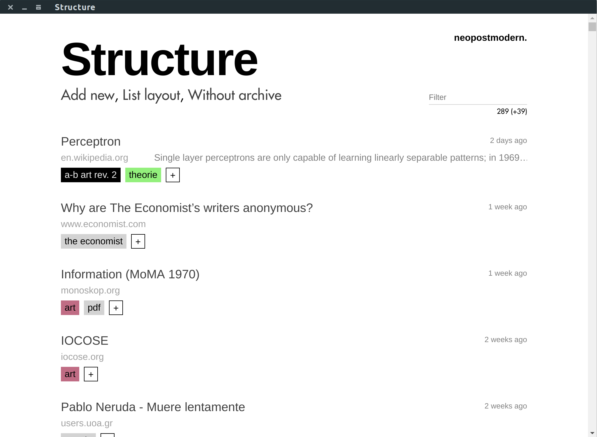

# Structure <sup></sup>

Structure is a performance-at-interaction oriented and reasonably stylish bookmarking tool for (eventually) everything.

It is work in progress, but values stability since it is in use already. 
Binaries / packaged applications can be found in [releases](https://github.com/neopostmodern/structure/releases). 
Keep in mind that these will use private server infrastructure, a privacy and security risk you do not necessarily want to take. 
Feel free to build and deploy the app and required server infrastructure yourself. 
See [below](https://github.com/neopostmodern/structure#server) on how to do so.



## Features

### It allow you to bookmark...
- [x] URLs (websites)
- [x] Notes
- [ ] Local files [#2](https://github.com/neopostmodern/structure/issues/2)

### ...and then...
- [x] multi-tag
	- [x] colored tags
	- [ ] easy visual organization of tag-color-space [#13](https://github.com/neopostmodern/structure/issues/13)
- [ ] search and browse efficiently
	- [x] full-text (URI, name, note & tags)
	- [x] by tag
	- [ ] by time-span [#14](https://github.com/neopostmodern/structure/issues/14)
	

### ...and it will automatically...
- [ ] Take a screenshot (where applicable) [#11](https://github.com/neopostmodern/structure/issues/11)
	- [ ] Viewport
	- [ ] Whole page
- [ ] Take a source-code snapshot (URLs only, prevents future deadlinks) [#4](https://github.com/neopostmodern/structure/issues/4)
- [ ] Ease metadata-entry
	- [x] Name suggestions (URLs only)
	- [ ] Tag suggestions [#5](https://github.com/neopostmodern/structure/issues/5)

## Keyboard shortcuts

Key combinations are not customizable, *yet* ([#7](https://github.com/neopostmodern/structure/issues/7))

| Key combination | Action |
|-|-|
| `[CTRL/CMD] + [n]` | Create new entry |
| `[CTRL/CMD] + [t]` | Add tag |
| `[CTRL/CMD] + [/]` | Back to default view (list of bookmarks) |


## Build / deploy

### Client

Configuration values are stored in `config.prod.json` (`config.dev.json` respectively for development).

```bash
npm run package-all
```
(Or to only target a specific platform: `package-linux` / `package-win` / `package-macos`).
AppImage (Linux), .exe (NSIS-Installer for Windows) and .tar.gz (macOS) are placed in `./release`

### Server

Deployment script variables are stored in `server/deploy/server.sh`, 
environment variables for server are stored in `server/deploy/config.json`.
Example files coming soon ([#6](https://github.com/neopostmodern/structure/issues/6)).
```bash
cd server
npm run deploy
```

## TODO:
```
apollo client:codegen --target typescript --includes='app/**/*.{ts,tsx}' --outputFlat app/generated
```

